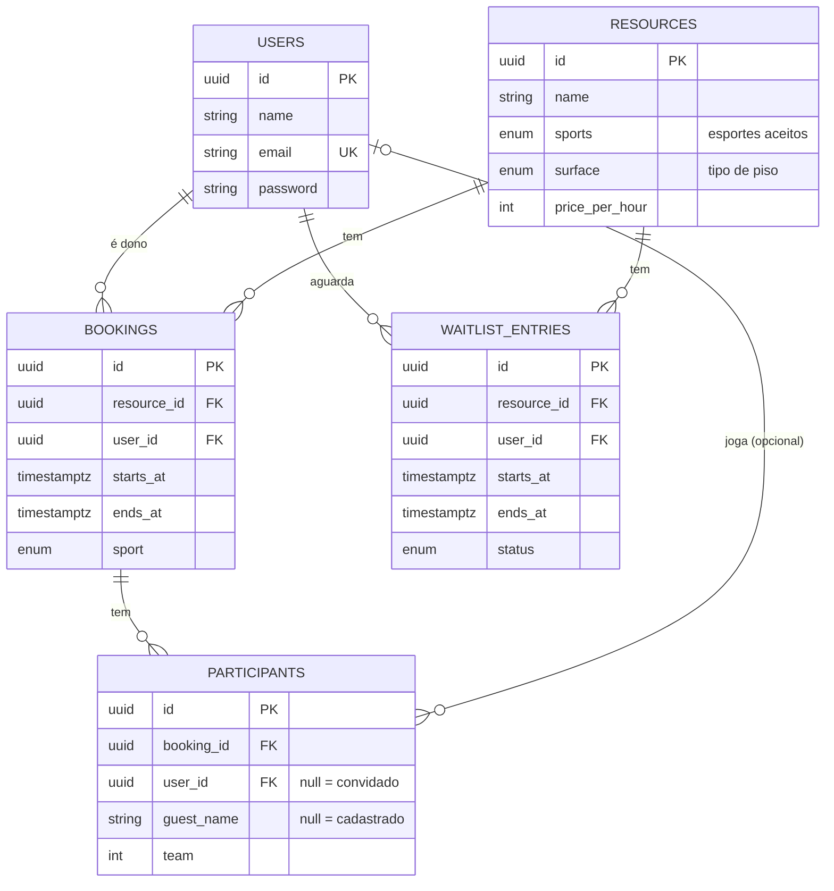
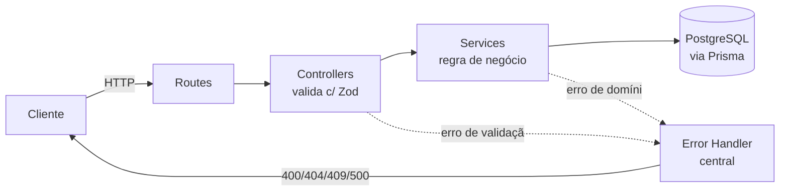
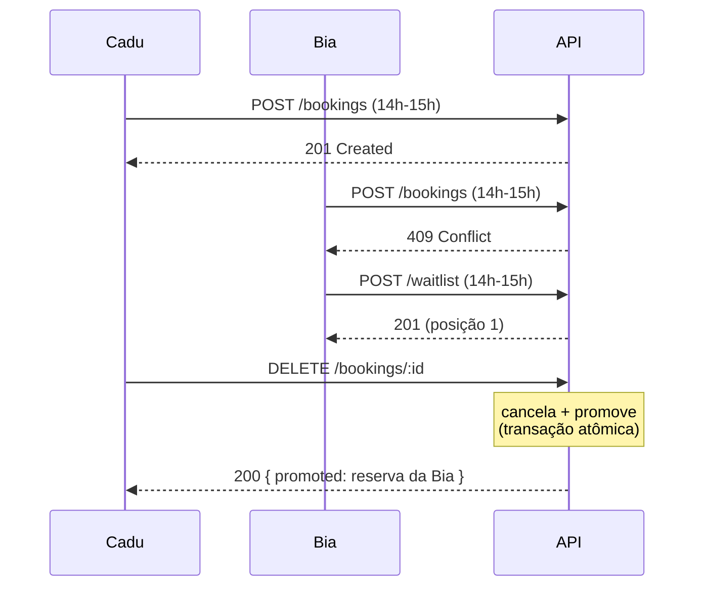

# 🏐 ReservaQuadra

Sistema de reserva de quadras esportivas que **garante, a nível de banco de dados, que nunca exista reserva dupla** — mesmo sob centenas de requisições simultâneas para o mesmo horário.

O foco do projeto não é o CRUD: é demonstrar **controle de concorrência correto** usando uma _exclusion constraint_ do PostgreSQL, em vez de locks manuais na aplicação.


---

## 🎯 O problema e a decisão técnica

Duas pessoas clicam "reservar" na mesma quadra, no mesmo horário, no mesmo instante. Como impedir o **double-booking**?

A abordagem ingênua — "checar se está livre e então inserir" (`SELECT` depois `INSERT`) — tem uma **condição de corrida**: as duas requisições checam, ambas veem "livre", e ambas inserem. Resolver isso na aplicação exige locks distribuídos, transações `SERIALIZABLE` com retry, ou filas — tudo complexo e fácil de errar.

**A decisão deste projeto:** delegar a garantia ao banco, com uma _exclusion constraint_:

```sql
CREATE EXTENSION IF NOT EXISTS btree_gist;

ALTER TABLE bookings
  ADD CONSTRAINT bookings_no_overlap
  EXCLUDE USING gist (
    resource_id WITH =,
    tstzrange(starts_at, ends_at, '[)') WITH &&
  );
```

Lê-se: _"não pode existir duas linhas com o **mesmo** `resource_id` (`WITH =`) cujos intervalos de tempo **se sobreponham** (`WITH &&`)"_. O `'[)'` torna o início inclusivo e o fim exclusivo — então **10h–11h e 11h–12h não conflitam** (encostam, não sobrepõem).

A integridade passa a ser uma **invariante do banco**, não uma esperança da aplicação. Qualquer caminho de código — API, script, query manual — é obrigado a respeitá-la.

---

## 🗂️ Modelo de dados



> A tabela `bookings` carrega a constraint `bookings_no_overlap` que é o coração do projeto.

---

## 🧱 Arquitetura

Camadas com responsabilidade única — a requisição flui de fora pra dentro, e os erros voltam por um handler central:



- **Controllers** validam a entrada (Zod) e formatam a resposta.
- **Services** contêm a regra de negócio e não conhecem HTTP.
- **Error handler central** traduz exceções em status HTTP (o `23P01` do banco vira **409**).

---

## ⚡ A prova de concorrência

O script [`scripts/load-test.ts`](scripts/load-test.ts) dispara **N reservas simultâneas** (`Promise.all`) para a mesma quadra e horário. O esperado: **exatamente 1 sucesso**, o resto bloqueado com `409`.

```bash
npm run loadtest -- 200
```

| Requisições simultâneas | Resultado | Tempo |
| --- | --- | --- |
| 50 | ✅ 1× `201` + 49× `409` | ~450ms |
| 100 | ✅ 1× `201` + 99× `409` | ~630ms |
| 200 | ✅ 1× `201` + 199× `409` | ~860ms |

**Zero double-booking em qualquer carga.**

### 🐛 A saga do deadlock (e a solução)

Na primeira versão, **100 requisições simultâneas geravam `deadlock detected` (40P01)** e ~93s de latência. Sob alta contenção na mesma chave, as transações entravam em ciclo de espera nos locks do índice GiST, e o Postgres abortava várias delas (cada deadlock custava ~1s do `deadlock_timeout`).

**Solução:** um _advisory lock_ por quadra dentro da transação de criação, serializando as escritas concorrentes em uma fila ordenada (sem ciclos = sem deadlock):

```ts
await tx.$executeRaw`SELECT pg_advisory_xact_lock(hashtext(${resourceId}))`;
return tx.booking.create({ data: input });
```

A constraint **sempre** garantiu a corretude; o advisory lock resolveu a **performance e a robustez**. Resultado: de 93s para <1s.

---

## 🎟️ Fila de espera (waitlist)

Quem tenta um horário ocupado pode entrar na fila. Ao **cancelar** uma reserva, o primeiro da fila (FIFO) é **promovido automaticamente** — tudo em uma transação atômica:



---

## 🏟️ Quadras & esportes

Cada quadra declara os **esportes que aceita** (futebol, vôlei, tênis, beach tennis, futevôlei, basquete), o **tipo de piso** (areia, saibro, sintético…) e um **preço/hora** (informativo). Ao reservar, escolhe-se **um** esporte dentre os que a quadra aceita — o backend valida (400 se não aceito). Por ora os atributos vêm do seed; a edição pela própria quadra entra na fase de contas de empresa.

## 🎮 Jogos & convidados

Uma reserva é um **jogo**: tem um **dono** (logado, responde pela quadra) e uma lista de **participantes**. Cada participante é um **usuário cadastrado** ou um **convidado** (só um nome, sem conta) — login é obrigatório só pra quem reserva, não pra quem joga. Uma **CHECK constraint** no banco garante que todo participante é exatamente um dos dois (`user_id` XOR `guest_name`). O dono entra como participante automaticamente ao criar o jogo.

## ⚖️ Times

O dono pode **sortear** os participantes em 2 a 4 times. O algoritmo embaralha (Fisher-Yates) e distribui em rodízio, então os times ficam equilibrados (tamanhos diferindo no máximo em 1). A escalação é persistida (campo `team`) e numa transação — todos recebem time ou ninguém. Dá pra re-sortear ou limpar.

## 🔐 Autenticação

JWT (Bearer token). Senhas guardadas com hash **bcrypt** (nunca em texto puro). No login/registro a API devolve um token; o cliente o envia no header `Authorization: Bearer <token>`. As rotas de reserva/fila são protegidas, e o `userId` vem **do token** — ninguém reserva em nome de outro. Cancelamento exige ser o **dono** da reserva (403 caso contrário).

## 🔌 API

| Método | Rota | 🔒 | Descrição |
| --- | --- | :-: | --- |
| `POST` | `/auth/register` | | Cria conta, devolve token |
| `POST` | `/auth/login` | | Autentica, devolve token |
| `GET` | `/auth/me` | 🔒 | Perfil do usuário logado |
| `GET` | `/health` | | Healthcheck (app + banco) |
| `GET` | `/resources` · `/resources/:id/availability?date=` | 🔒 | Quadras e disponibilidade |
| `POST` | `/bookings` | 🔒 | Cria reserva/jogo (`409` se conflitar) |
| `GET` | `/bookings?resourceId=&date=` | 🔒 | Lista jogos (com participantes) |
| `DELETE` | `/bookings/:id` | 🔒 | Cancela (e promove a fila, se houver) |
| `POST` | `/bookings/:id/participants` | 🔒 | Adiciona participante (usuário ou convidado) |
| `DELETE` | `/bookings/:id/participants/:pid` | 🔒 | Remove participante (só o dono) |
| `POST` | `/bookings/:id/teams/randomize` | 🔒 | Sorteia os participantes em N times (2–4) |
| `DELETE` | `/bookings/:id/teams` | 🔒 | Desfaz a escalação |
| `POST` | `/waitlist` | 🔒 | Entra na fila de um horário |
| `GET` | `/waitlist?resourceId=` | 🔒 | Lista a fila com posição |
| `DELETE` | `/waitlist/:id` | 🔒 | Sai da fila |

🔒 = exige token. Erros padronizados: **400** (validação), **401** (não autenticado), **403** (sem permissão), **404** (não encontrado), **409** (conflito), **500** (inesperado).

---

## 🖥️ Frontend

Uma SPA em **React + Vite** (pasta [`web/`](web/)) dá uma visualização do sistema funcionando: **login/registro**, grade de disponibilidade por quadra/dia, criar e cancelar reservas, fila de espera com promoção automática, e um **botão que dispara N reservas simultâneas** mostrando ao vivo "1 criada + N-1 conflito".

Dá pra **selecionar vários horários** e reservar de uma vez: blocos contíguos viram uma reserva só (10h+11h → 10h–12h), separados viram reservas distintas. As datas aparecem em formato amigável ("Segunda, dia 22 · 19h–20h").

O token JWT é guardado no `localStorage` e enviado em cada requisição; a sessão é restaurada no reload via `GET /auth/me`. A API habilita CORS pra a SPA consumi-la. Conta demo: `cadu@reservaquadra.dev` / `senha123`.

## 🚀 Como rodar

**Pré-requisitos:** Node 24+ e Docker.

```bash
# 1. Subir o Postgres (com a extensão btree_gist já disponível)
docker compose up -d

# 2. Instalar dependências
npm install

# 3. Aplicar as migrations (cria tabelas + a exclusion constraint)
npx prisma migrate dev

# 4. Popular dados de exemplo (usuários e quadras)
npm run seed

# 5. Subir a API (porta 3000)
npm run dev
```

Provar a concorrência pela linha de comando:

```bash
npm run loadtest -- 200
```

Subir o frontend (em outro terminal, com a API rodando):

```bash
cd web
npm install
npm run dev   # abre em http://localhost:5173
```

## 🧪 Testes

Testes de integração contra um **Postgres real e descartável** (Testcontainers): cada execução sobe um container próprio, aplica as migrations e roda a suíte contra ele — sem mocks. Cobrem o coração do projeto: a exclusion constraint (409), horários encostados, FK inexistente (404), **concorrência** (30 simultâneas → 1 sucesso) e a **promoção da waitlist**.

```bash
npm test
```

> ℹ️ O `docker-compose.yml` mapeia o Postgres na porta **5433** do host (pra não conflitar com uma instalação local na 5432). A `DATABASE_URL` já reflete isso.

---

## 🧰 Stack e decisões

- **TypeScript (strict) + ESM** — segurança de tipos de ponta a ponta.
- **PostgreSQL 16** — pela _exclusion constraint_ + `tstzrange`, que tornam o projeto possível.
- **Prisma 7** — ORM tipado; a constraint entra via migration SQL manual (o Prisma não a expressa nativamente).
- **Express 5 + Zod 4** — API enxuta com validação declarativa.
- **pino** — logs estruturados (JSON) com id de requisição.
- **Docker Compose** — banco reproduzível com um comando.

## 📁 Estrutura

```
src/
├─ controllers/   # validação (Zod) + formato da resposta
├─ services/      # regra de negócio (booking, resource, waitlist)
├─ routes/        # mapeamento URL → controller
├─ middlewares/   # error handler central
├─ db/            # client único do Prisma
├─ pg-errors.ts   # detecção de erros do Postgres (23P01, 23503...)
├─ app.ts         # montagem do Express
└─ server.ts      # ponto de entrada
prisma/
├─ schema.prisma  # models
├─ migrations/    # incl. a migration com a EXCLUDE constraint
└─ seed.ts        # dados de exemplo
scripts/
└─ load-test.ts   # prova de concorrência
```
